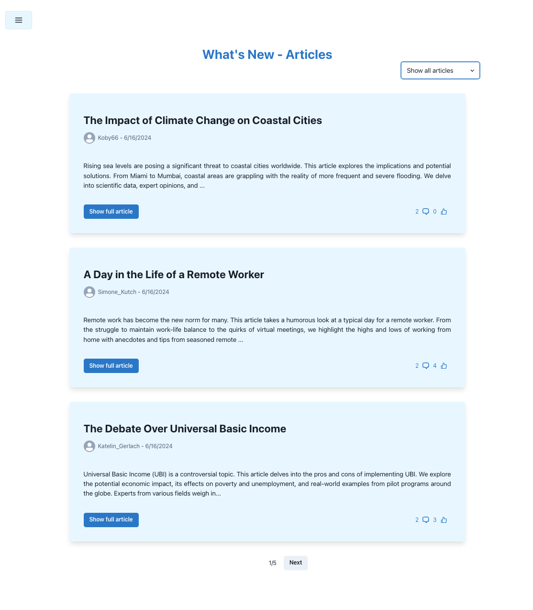
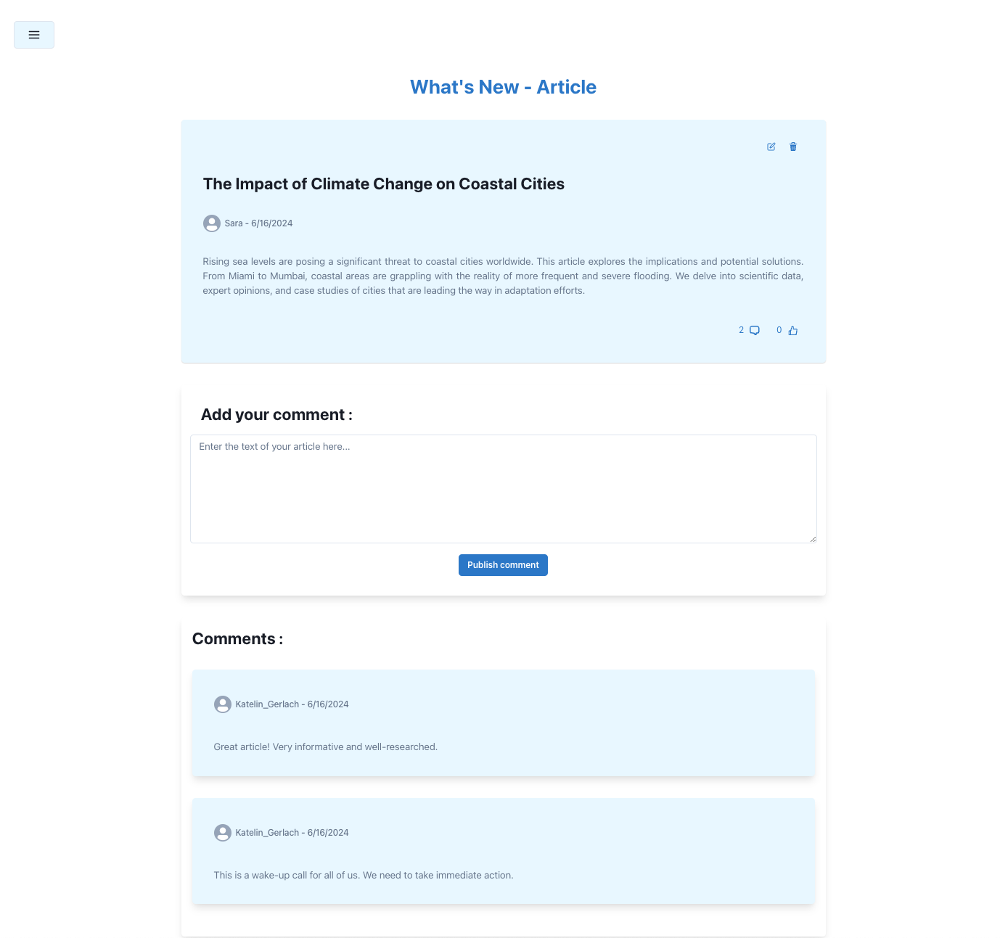
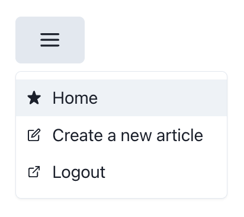

# WhatsNew App

This is a **social network for sharing articles**. It's built with **TypeScript**, using **React** and **Chakra UI** for the frontend, and **Node.js** with **Prisma** and **SQLite** for the backend. The application uses **GraphQL** for efficient, flexible data retrieval on both the server and client side.

## Pages and main features

## Article List Page (Home Page)

- Here users can see all the most recent articles and **filter** them (see all articles, most liked or their articles)
- They can **delete** their articles or click on a button to **update** them
- They can **like** or unlike an article or click to **comment** one
- A **pagination** can be found on the bottom of the page

## Article Detail Page

- At the top of the page, users can **read** the article and **like** it
- At the center of the page, there is a form for **adding a comment**
- At the bottom of the page, a list of comments is shown

## Create and Update Article Pages
- A page for **creating an article** is accessible from the Home Page and the Article Detail Page
- A page for **updating an article** is accessible from the Home Page and the Article Detail Page

## Navigation component

- This is a navigation, **layout component** that enables users to go to the Home page, create an article or logout

## Sign Up and Sign In Pages
- Here users can sign up with a **username** and a **password**
- Then users can sign in

## Technologies Used

- **TypeScript** : a statically typed superset of JavaScript that adds types to the language
- **Apollo Server** : an open-source GraphQL server, used to build a self-documenting API
- **GraphQL Codegen**: to automatically generate types from GraphQL schemas
- **Prisma** : an open-source ORM (Object-Relational Mapping) for Node.js
- **SQLite** : a lightweight, file-based database system, based on SQL queries
- **React** : a JavaScript library to build fast single pages applications
- **Apollo Client** : a frontend library for JavaScript that enables you to manage both local and remote data with GraphQL
- **Chakra UI** : a modular component library for building React Applications
- **React Hook Form**: a library providing an API for handling and validating form data

## Getting Started
💡 **You can find a video  [preview.mp4](preview.mp4) in the root to watch a preview of the app**

### Requirements

-  Node.js `v20.11.1`

### Setting up and launching the server
1. Clone the repository to your local machine.
2. Navigate to the `server` directory and install the required dependencies with `npm install`.
3. To launch a migration of the database, run `npm run prisma:migrate`.
4. Generating Fake Data  **(optionnal)**: To test the website, you can generate fake data. Run `npm run data:generate` to generate articles and users. You can connect to a specific user by checking the file `server/prisma/fake-users.json`, or you can create your own user.
5. Run the Node.js server:
   - If your `package.json` uses `dev` to start the server, use `npm run dev`.
   - Alternatively, if the script is configured to use `start`, use `npm start` or `npm run start`.

### Setting up and launching the client
1. You have cloned the repository on your local machine
2. Navigate to the `client` directory and install the required dependencies with `npm install`.
3. Start the client with `npm run dev`.
4. Open your browser and navigate to `http://localhost:5173` to start using the application.
5. Sign up on the platform!

## Authors

This project was created by:
- Sabevi - [GitHub](https://github.com/sabevi)
- Zlahrouni - [Official Website](https://ziadlahrouni.com)
- Tamdasab - [GitHub](https://github.com/tamdasab)

## Contributing

Pull requests are welcome. For major changes, please open an issue first to discuss what you would like to change.
